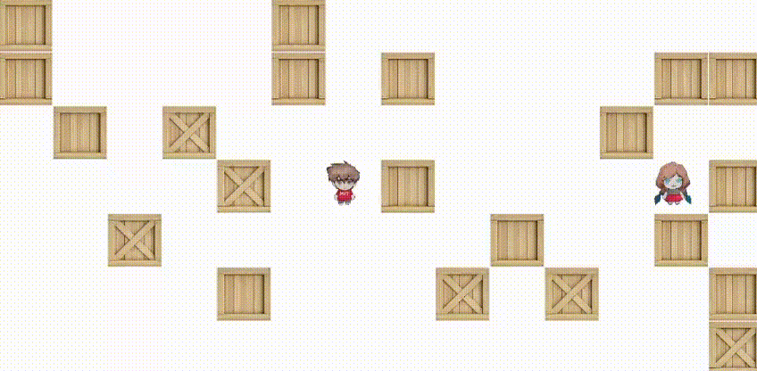
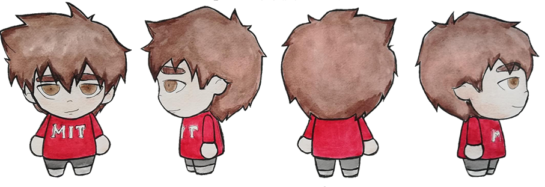

# BoMGerman

A classic Bomberman-style game built with SFML (Simple and Fast Multimedia Library) in C++.

## Description

BoMGerman is a two-player arcade game where players navigate a grid-based arena, place bombs to destroy obstacles and defeat their opponent. Each player controls a hero character that can move in four directions and drop bombs with timed explosions.

## Features

- **Two-player local multiplayer** - compete against a friend on the same keyboard
- **Particle-based explosion system** - dynamic visual effects for bomb explosions
- **Collision detection** - players interact with walls, each other, and explosions
- **Hand-painted watercolor characters** - unique character sprites originally painted with watercolors and digitally processed
- **Sound effects** - explosion sounds
- **Destructible obstacles** - randomly placed crates add strategic variety

## Gameplay Video

<!-- Add gameplay video here (MP4, GIF, or YouTube link) -->

## Controls

### Player 1
- **Movement**: W, A, S, D
- **Drop Bomb**: Left Control

### Player 2
- **Movement**: Arrow Keys (↑, ←, ↓, →)
- **Drop Bomb**: Right Control

### General
- **Exit Game**: ESC

## Character Art

All character sprites in BoMGerman are **hand-painted using watercolors** and then digitally processed to create the final game assets. Each character has unique directional sprites for authentic gameplay experience.

### Player 1 Character
<table>
  <tr>
    <td align="center"><b>Front View</b></td>
    <td align="center"><b>Left View</b></td>
    <td align="center"><b>Back View</b></td>
    <td align="center"><b>Right View</b></td>
  </tr>
  <tr>
    <td colspan="4"></td>
  </tr>
</table>

### Player 2 Character
<table>
  <tr>
    <td align="center"><b>Front View</b></td>
    <td align="center"><b>Left View</b></td>
    <td align="center"><b>Back View</b></td>
    <td align="center"><b>Right View</b></td>
  </tr>
  <tr>
    <td colspan="4"></td>
  </tr>
</table>

### Artistic Process
1. **Watercolor Painting** - Characters initially sketched and painted using traditional watercolor techniques
2. **Digitization** - Scanned and imported into digital format
3. **Processing** - Enhanced and optimized for game use
4. **Sprite Creation** - Final sprites created for all directional views

## Technical Details

### Classes

- **`Game`** - Main game loop, handles initialization, collision detection, and rendering
- **`Hero`** - Player character with movement and bomb-dropping capabilities
- **`Bomb`** - Explosive objects with timed detonation and particle effects
- **`ParticleSystem`** - Visual explosion effects using particle simulation

### SFML Libraries Used
- `sfml-graphics`
- `sfml-window`
- `sfml-system`
- `sfml-audio`

